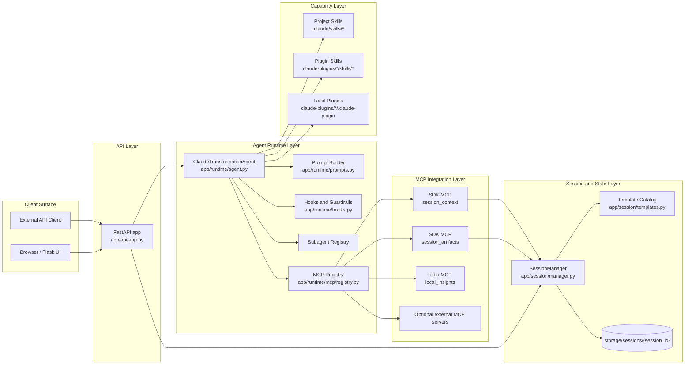
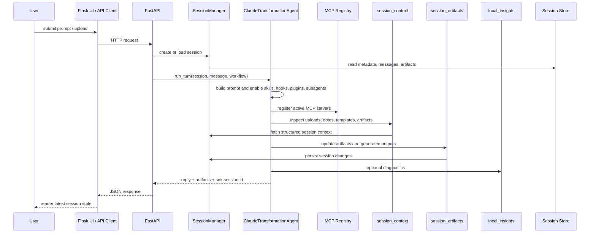

# Data Transformation Agent

Python project for a document and data transformation agent built on the Claude Agent SDK, with:

- a FastAPI backend
- a separate Flask UI
- project and plugin Skills
- multiple MCP servers
- programmatic subagents
- session persistence on disk
- per-session markdown artifacts that the agent keeps current

This repo is now structured to make the MCP story explicit:

- the app exposes project-specific MCP tools through in-process SDK servers
- the app also connects to a separate stdio MCP server process as an external-tool example
- the runtime can optionally connect to real external MCP servers such as GitHub or a remote HTTP/SSE MCP endpoint

## Project tree

```text
data-transformation-agent/
├── .claude/
│   ├── settings.json
│   └── skills/
│       ├── transformation-discovery/
│       ├── dependency-mapping/
│       └── delivery-planning/
├── .vscode/
│   └── launch.json
├── app/
│   ├── api/
│   │   └── app.py
│   ├── core/
│   │   ├── config.py
│   │   └── models.py
│   ├── runtime/
│   │   ├── agent.py
│   │   ├── hooks.py
│   │   ├── prompts.py
│   │   └── mcp/
│   │       ├── annotations.py
│   │       ├── registry.py
│   │       └── servers/
│   │           ├── session_artifacts.py
│   │           └── session_context.py
│   ├── session/
│   │   ├── manager.py
│   │   └── templates.py
│   └── web/
│       ├── app.py
│       ├── static/
│       └── templates/
├── claude-plugins/
│   └── transformation-delivery-helper/
│       ├── .claude-plugin/plugin.json
│       └── skills/
│           └── authority-check/
├── scripts/
│   ├── hooks/
│   └── mcp/
│       └── project_insights_server.py
├── storage/sessions/
├── templates/
├── CLAUDE.md
├── run_api.py
├── run_ui.py
├── requirements.txt
└── README.md
```

## Architecture boundaries

The repo now follows explicit agentic component boundaries rather than a flat app layout:

- `app/api`
  HTTP contract and request handling for the FastAPI backend.

- `app/runtime`
  Claude runtime orchestration: prompt construction, hook guardrails, subagent registry, plugin wiring, and MCP registration.

- `app/runtime/mcp/servers`
  One module per in-process MCP server so MCP tools are separated by responsibility instead of mixed into the runtime layer.

- `app/session`
  Session persistence, artifact lifecycle, uploads, outputs, and template instantiation.

- `app/core`
  Shared configuration and typed domain models used across API, runtime, session, and UI layers.

- `app/web`
  Flask UI shell plus its dedicated static and template assets.

- `.claude/skills` and `claude-plugins/`
  Project skills, plugin skills, and plugin manifests remain separate at the repository root where the SDK expects them.

- `scripts/mcp/project_insights_server.py`
  Separate stdio MCP process used as the external-process MCP example.

This gives you the separation you asked for: APIs, runtime, prompts, hooks, MCP registry, MCP tool surfaces, session state, skills, and plugins each live in a dedicated subtree.

## Skills

The skill files now follow the documented frontmatter format with explicit `name` and `description` fields:

- `transformation-discovery`
- `dependency-mapping`
- `delivery-planning`
- `authority-check`

These names align with the current Claude skill guidance that the frontmatter should clearly define the skill identity and when the model should use it:

- Claude Code skills overview: <https://code.claude.com/docs/en/skills>
- Skill best practices: <https://platform.claude.com/docs/en/agents-and-tools/agent-skills/best-practices>

## MCP architecture

### MCP servers used by the runtime

1. `session_artifacts` (`sdk`)
   Exposes project-owned tools such as reading and writing markdown artifacts and generated outputs.

2. `session_context` (`sdk`)
   Exposes project-owned tools for session metadata, uploads, and template blueprints.

3. `local_insights` (`stdio`)
   Launches `scripts/mcp/project_insights_server.py` as a separate MCP process. This demonstrates MCP over stdio and external-process tool connectivity inside the project.

4. Optional external MCP servers
   The runtime can also connect to:
   - `github` via stdio using `npx @modelcontextprotocol/server-github`
   - a remote HTTP/SSE MCP endpoint via environment variables

This follows the Claude Agent SDK MCP model:

- connect to MCP servers through `mcpServers`
- pre-approve server tools with `allowedTools` patterns such as `mcp__session_artifacts__*`
- rely on tool search to load only relevant tools when the catalog grows

References:

- MCP in the Agent SDK: <https://code.claude.com/docs/en/agent-sdk/mcp>
- Tool search: <https://code.claude.com/docs/en/agent-sdk/tool-search>

### System component view



### Turn lifecycle



### Runtime responsibilities

1. `app/api/app.py` is the ingress layer and owns HTTP contracts only.
2. `app/session/manager.py` is the system of record for sessions, uploads, artifacts, outputs, and message history.
3. `app/runtime/agent.py` owns Claude SDK orchestration and never directly persists files without going through session services or MCP tools.
4. `app/runtime/mcp/registry.py` decides which MCP servers are active for the current run.
5. `app/runtime/mcp/servers/session_context.py` exposes read-oriented session state to the model.
6. `app/runtime/mcp/servers/session_artifacts.py` exposes controlled write paths for artifacts and outputs.
7. `app/runtime/hooks.py` applies runtime guardrails and audit logging around tool use.
8. `.claude/skills` and `claude-plugins/` provide reusable procedural behavior outside the Python runtime code.

## MCP tools exposed by this project

### `session_artifacts`

- `list_session_assets`
- `read_session_artifact`
- `write_session_artifact`
- `write_session_output`

### `session_context`

- `describe_session_context`
- `read_session_upload`
- `list_template_blueprints`
- `read_template_blueprint`

### `local_insights`

- `inspect_python_runtime`
- `list_skill_inventory`
- `git_worktree_summary`

You can inspect the enabled runtime surface without starting an agent turn at:

```text
GET /api/runtime/capabilities
```

## Setup

1. Create and activate the virtual environment.

```bash
python3 -m venv .venv
source .venv/bin/activate
```

2. Install dependencies.

```bash
pip install -r requirements.txt
```

3. Create `.env` from the example and set `ANTHROPIC_API_KEY`.

```bash
cp .env.example .env
```

4. Run the API.

```bash
python run_api.py
```

5. Run the UI in a separate terminal.

```bash
python run_ui.py
```

Default URLs:

- API: `http://127.0.0.1:8000`
- Swagger: `http://127.0.0.1:8000/docs`
- UI: `http://127.0.0.1:5000`

## VS Code launch configs

`.vscode/launch.json` includes:

- `Data Transformation API`
- `Data Transformation UI`
- `Data Transformation API + UI`

So you can run them separately or together from VS Code.

## Optional external MCP configuration

The repo includes environment-variable driven examples for external MCP connectivity:

- `DATA_TRANSFORM_AGENT_GITHUB_MCP_ENABLED=true`
- `DATA_TRANSFORM_AGENT_GITHUB_TOKEN=...`
- `DATA_TRANSFORM_AGENT_REMOTE_MCP_ENABLED=true`
- `DATA_TRANSFORM_AGENT_REMOTE_MCP_TYPE=http` or `sse`
- `DATA_TRANSFORM_AGENT_REMOTE_MCP_URL=...`

These are intentionally optional so the project stays runnable locally without extra infrastructure.

## Notes

- The code imports and compiles cleanly under Python 3.13 in the recreated `.venv`.
- `mcp` is now declared as a direct dependency because the project imports it directly, rather than relying on a transitive install through the SDK.
